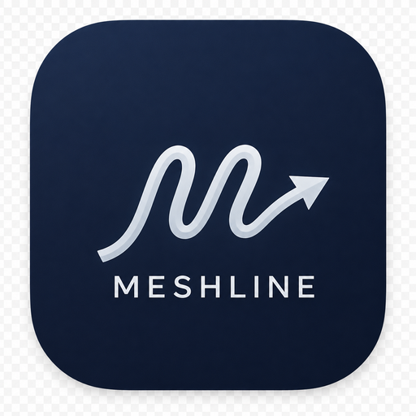
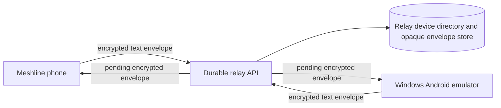

# Meshline



**Meshline** is a mobile-first, text-only messenger prototype for direct chats, groups, channels, and local identity. It is designed around clear ownership of the device-side experience: no phone-number requirement, no user-uploaded media, no wallet, and no blockchain feature set.

> **Current status:** Meshline is an experimental prototype. Its relay transport and cross-device space fanout are useful for two-device testing, but they are **not** a production-audited end-to-end encryption protocol or a fully decentralized messaging network.

## What currently works

| Area | Current capability |
|---|---|
| Identity | Local name, `@username`, description, recovery flow, logout, and local-account deletion controls. |
| Direct messages | Experimental encrypted relay delivery between registered devices, including durable opaque envelopes and offline retrieval. |
| Groups and channels | Text-only creation and owner controls. Registered members receive experimental individually encrypted fanout; this is not a secure group protocol. |
| Everyday messaging | Saved Messages, local global search across chats and accessible text, message actions, pinned chats, and local unread indicators. |
| Appearance | A dark-navy and white Meshline visual system with persisted light and dark modes. |
| Updates | Compatible JavaScript updates are checked from **Network → App updates**. Runtime or native changes can require a replacement APK. |

## Product boundary

Meshline deliberately remains **text-only**. It does not add images, files, voice notes, calls, payments, wallets, blockchain features, or user-uploaded avatars. This keeps the current product focused on dependable text communication and understandable controls.

The relay stores opaque ciphertext envelopes and delivery metadata rather than direct-message plaintext. That is a useful experiment, not a claim of production E2EE. Current limitations include the absence of X3DH session setup, Double Ratchet, audited identity verification, key transparency, signed or one-time prekeys, device lifecycle management, and a true secure group protocol. See [transport-security-references.md](docs/transport-security-references.md) for the staged, audit-first roadmap.

## Architecture at a glance



The mobile client owns local identity, messages, contacts, settings, and transport-key observations. The server exposes the relay API and database-backed opaque-envelope persistence. Source for both client and relay is included in this public repository; deployed credentials, relay records, and database contents are not.

## Run the project locally

Meshline uses Expo SDK 54, React Native, TypeScript, Express, Drizzle, and a managed MySQL-compatible database. The repository is easiest to run in the managed project environment because its relay and deployment configuration are provided there.

```bash
pnpm install
pnpm dev
```

For a clean type check, run:

```bash
pnpm exec tsc --noEmit --incremental false
```

The relay database schema and migrations are in [`drizzle/`](drizzle/), while the server implementation is in [`server/`](server/). Do not commit credential files, deployment tokens, or real relay records.

## Testing on Android

Use the exact APK file that has already worked on each device. The public [Android testing guide](docs/ANDROID_TESTING.md) explains the safe phone/emulator path, the matching update channel, and the experimental two-device test checklist.

## Documentation

| Guide | Purpose |
|---|---|
| [Android testing](docs/ANDROID_TESTING.md) | Phone and Windows-emulator setup, safe updates, and two-device checks. |
| [Transport security roadmap](docs/transport-security-references.md) | Honest explanation of today’s transport and the production-security path. |
| [Project TODO](todo.md) | Product, reliability, documentation, and validation backlog. |

## Contribution principles

Contributions should preserve the text-only scope, keep security statements factual, avoid adding user data collection without explicit product approval, and include deterministic tests for behavioral changes. Any new protocol or cryptographic claim should be designed, reviewed, and independently audited before it is described as production-ready.

## Roadmap

The next practical work is to complete installed-device tests for offline direct messages and group/channel owner changes; clarify delivery recovery behavior; finish the mobile visual pass; and publish fuller development, release, and contribution guides. Production-grade messaging security remains a separate, longer-term protocol and audit program.
